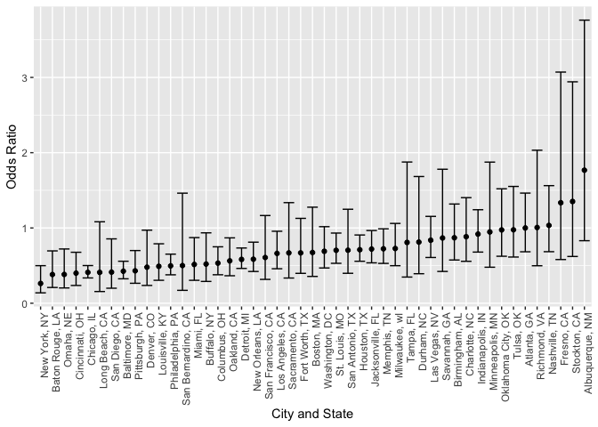
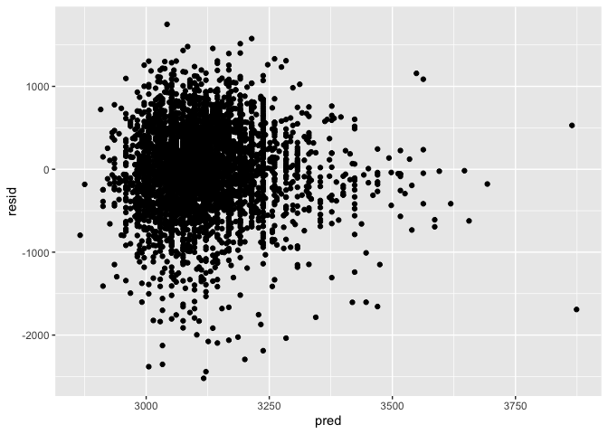
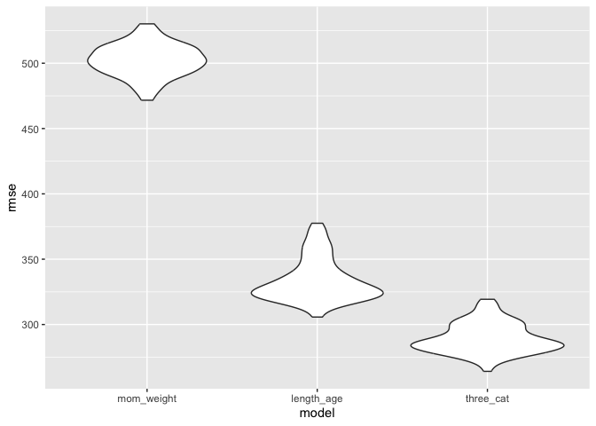

scs2267_hw6
================

``` r
library(tidyverse)
```

    ## ── Attaching core tidyverse packages ──────────────────────── tidyverse 2.0.0 ──
    ## ✔ dplyr     1.1.4     ✔ readr     2.1.5
    ## ✔ forcats   1.0.0     ✔ stringr   1.5.1
    ## ✔ ggplot2   3.5.1     ✔ tibble    3.2.1
    ## ✔ lubridate 1.9.3     ✔ tidyr     1.3.1
    ## ✔ purrr     1.0.2     
    ## ── Conflicts ────────────────────────────────────────── tidyverse_conflicts() ──
    ## ✖ dplyr::filter() masks stats::filter()
    ## ✖ dplyr::lag()    masks stats::lag()
    ## ℹ Use the conflicted package (<http://conflicted.r-lib.org/>) to force all conflicts to become errors

``` r
library(readr)
library(modelr)

set.seed(1)
```

## Problem 1

``` r
weather_df = 
  rnoaa::meteo_pull_monitors(
    c("USW00094728"),
    var = c("PRCP", "TMIN", "TMAX"), 
    date_min = "2017-01-01",
    date_max = "2017-12-31") %>%
  mutate(
    name = recode(id, USW00094728 = "CentralPark_NY"),
    tmin = tmin / 10,
    tmax = tmax / 10) %>%
  select(name, id, everything())
```

    ## using cached file: /Users/sony/Library/Caches/org.R-project.R/R/rnoaa/noaa_ghcnd/USW00094728.dly

    ## date created (size, mb): 2024-12-02 21:30:07.054661 (8.667)

    ## file min/max dates: 1869-01-01 / 2024-11-30

``` r
boot_results = 
  weather_df %>% 
  modelr::bootstrap(1000) |> 
  mutate(
    strap = map(strap, as_tibble),
    models = map(strap, \(df) lm(tmax ~ tmin, data = df)),
    results1 = map(models, broom::glance),
    results2 = map(models, broom::tidy),
  ) |> 
  unnest(results1, results2) 
```

    ## Warning: `unnest()` has a new interface. See `?unnest` for details.
    ## ℹ Try `df %>% unnest(c(results1, results2))`, with `mutate()` if needed.

``` r
boot_results_ci = boot_results |> 
 group_by(.id, term) |> 
  summarize(
    boot_ci_ll = quantile(estimate, .025),
    boot_ci_ul = quantile(estimate, .975)
  )
```

    ## `summarise()` has grouped output by '.id'. You can override using the `.groups`
    ## argument.

``` r
final_results = boot_results %>% 
  filter(term %in% c("(Intercept)", "tmin")) %>%
  pivot_wider(names_from = term, values_from = estimate) %>% 
  group_by(.id) %>% 
  rename(beta_0 = `(Intercept)`, beta_1 = tmin) %>% 
  mutate(
    log_betas = log(beta_0 * beta_1)
  ) %>%
  left_join(
    boot_results_ci |> filter(term == "tmin"), 
    by = ".id"
  ) %>% 
  select(.id, r.squared, log_betas, boot_ci_ll, boot_ci_ul)
```

## Problem 2

``` r
homicide = read_csv("./data/homicide-data1.csv") %>% 
  mutate(
    city_state = paste(city, state, sep = ", "),
    case_status = if_else(disposition == "Closed without arrest"|disposition == "Open/No arrest", 0, 1),
    victim_age = as.numeric(victim_age)
  ) %>% 
  filter(victim_race != "Unknown" & city_state != "Tulsa, AL" & uid != "Tul-000769" & victim_race == "Black" | victim_race == "White")
```

    ## Rows: 52178 Columns: 12
    ## ── Column specification ────────────────────────────────────────────────────────
    ## Delimiter: ","
    ## chr (9): uid, victim_last, victim_first, victim_race, victim_age, victim_sex...
    ## dbl (3): reported_date, lat, lon
    ## 
    ## ℹ Use `spec()` to retrieve the full column specification for this data.
    ## ℹ Specify the column types or set `show_col_types = FALSE` to quiet this message.

    ## Warning: There was 1 warning in `mutate()`.
    ## ℹ In argument: `victim_age = as.numeric(victim_age)`.
    ## Caused by warning:
    ## ! NAs introduced by coercion

### Logistic Regression Output for Solving Homicides by Sex Controlling for Race and Age in Baltimore

``` r
bal_homicide = homicide %>% 
  filter(city_state == "Baltimore, MD")

fit_logistic = bal_homicide %>% 
  glm(case_status ~ victim_age + victim_race + victim_sex, data = ., family = binomial())

fit_logistic %>% 
  broom::tidy() %>% 
  janitor::clean_names() %>% 
  filter(term == "victim_sexMale") %>% 
  mutate(
    OR = exp(estimate),
    ci_high = exp(estimate+(1.96*std_error)),
    ci_low = exp(estimate-(1.96*std_error))) %>% 
  select(term, estimate, OR, ci_high, ci_low) %>% 
  knitr::kable(digits = 3)
```

| term           | estimate |    OR | ci_high | ci_low |
|:---------------|---------:|------:|--------:|-------:|
| victim_sexMale |   -0.854 | 0.426 |   0.558 |  0.325 |

### Logistic Regression Output Plot for Solving Homicides by Sex Controlling for Race and Age in All Cities

``` r
logis_func = function(place){
  
  observation = homicide %>% 
    filter(city_state==place)
  
  logistic = glm(case_status ~ victim_age + victim_race + victim_sex, data = observation, family = binomial()) %>% 
    broom::tidy()
  
  return(logistic)
}


all_cities = homicide %>% 
  group_by(city_state) %>% 
  nest() %>% 
    mutate(
      output = purrr::map(
        city_state, logis_func))%>% 
    unnest(output) %>% 
    janitor::clean_names() %>% 
  filter(term == "victim_sexMale") %>% 
  mutate(
    OR = exp(estimate),
    ci_high = exp(estimate+(1.96*std_error)),
    ci_low = exp(estimate-(1.96*std_error))) %>% 
  select(term, estimate, OR, ci_high, ci_low)
```

    ## Adding missing grouping variables: `city_state`

``` r
all_cities %>% 
  ungroup() %>%
 mutate(
   city_state = as.factor(city_state),
   city_state = fct_reorder(city_state, OR)
 ) %>% 
  ggplot(aes(x = city_state, y = OR))+
  geom_point()+
  theme(axis.text.x = element_text(angle = 90, hjust = 1))+
  geom_errorbar(aes(ymin = ci_low, ymax = ci_high))+
   labs(
    x = "City and State",
    y = "Odds Ratio"
  )
```

<!-- -->

It appears that New York City has the lowest odds of solving homicides
by gender, and Albuquerque has the highest odds of solving homicides by
gender when controlling for age and race.

## Regression Models for Factors Affecting Child’s Birthweight

For my regression model, I aim to view the effect of mother’s pre
pregnancy weight on a baby’s weight at birth.I used a linear regression
with “bwt” as the outcome variable, and “ppwt” as the predictor
variable. My model is: bwt = (intercept) + ppwt.

Based on the Residual vs. Fitted plot, it appears that the assumption of
equal variances is not met for this model, as there appears to be a
higher spread in residual values between fitted values 3000 and 3250
than 3250 and 3750. However, the model does not appear to show
violations in linearity, as the points are randomly scattered without
any significant curvature. Because of this, I decided to keep my
proposed linear model.

``` r
birth = read_csv("./data/birthweight.csv")
```

    ## Rows: 4342 Columns: 20
    ## ── Column specification ────────────────────────────────────────────────────────
    ## Delimiter: ","
    ## dbl (20): babysex, bhead, blength, bwt, delwt, fincome, frace, gaweeks, malf...
    ## 
    ## ℹ Use `spec()` to retrieve the full column specification for this data.
    ## ℹ Specify the column types or set `show_col_types = FALSE` to quiet this message.

``` r
mom_weight_reg = lm(bwt~ppwt, data = birth)

birth %>% 
   add_predictions(mom_weight_reg) %>% 
   add_residuals(mom_weight_reg) %>% 
  ggplot(aes(x = pred, y = resid))+
  geom_point()
```

<!-- -->

``` r
birth = birth %>% 
  mutate(
    id = row_number()
  )

train_df = sample_frac(birth, size = .8)
test_df = anti_join(birth, train_df, by = "id")

cv_df = 
  modelr::crossv_mc(birth, 100) 

cv_df = cv_df %>% 
  mutate(
    train = purrr::map(train, as_tibble),
    test = purrr::map(test, as_tibble)
  )

cv_df = 
  cv_df %>%  
  mutate(
    mom_weight_mod  = purrr::map(train, \(df) lm(bwt~ppwt, data = df)),
    length_age_mod  = purrr::map(train, \(df) lm(bwt~blength + gaweeks, data = df)),
    three_cat_mod  = purrr::map(train, \(df) lm(bwt~bhead + blength + babysex + bhead*blength + blength*babysex + bhead*babysex + bhead*blength*babysex, data = df))) %>%  
  mutate(
    rmse_mom_weight = purrr::map2_dbl(mom_weight_mod, test, \(mod, df) rmse(model = mod, as.data.frame(df))),
    rmse_length_age = purrr::map2_dbl(length_age_mod, test, \(mod, df) rmse(model = mod, data = as.data.frame(df))),
    rmse_three_cat = purrr::map2_dbl(three_cat_mod, test, \(mod, df) rmse(model = mod, as.data.frame(df))))

cv_df %>%  
  select(starts_with("rmse")) %>% 
  pivot_longer(
    everything(),
    names_to = "model", 
    values_to = "rmse",
    names_prefix = "rmse_") %>%  
  mutate(model = fct_inorder(model)) %>%  
  ggplot(aes(x = model, y = rmse)) + geom_violin()
```

<!-- -->

Based on this model, it appears that the model for length at birth and
gestational age is the best model to use. This model has a distribution
of rmses that are lower than the model I proposed, and although the
three variable and interaction model has lower rmses than length_age, it
has a wider spread.
